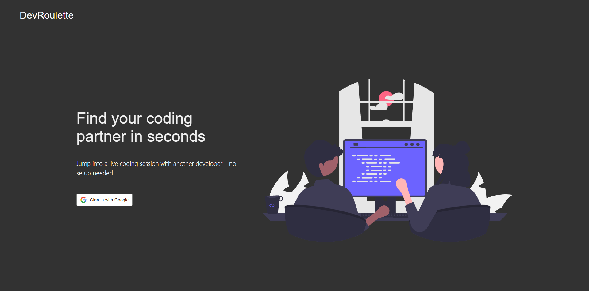
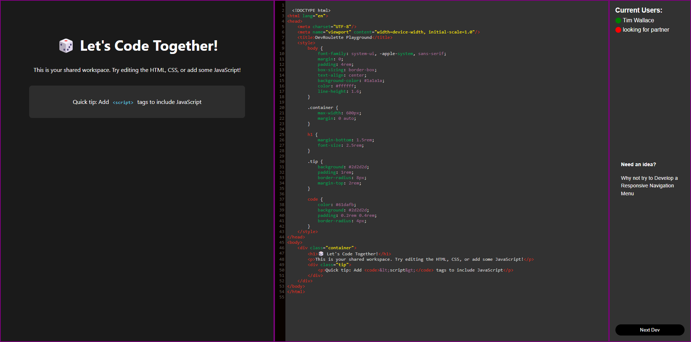

# 🎲 DevRoulette

Find your coding partner in seconds! DevRoulette is a web platform that instantly connects developers for pair programming sessions, featuring a real-time collaborative code editor focused on web development.

## 🚀 Features

- **Instant Matching**: Get paired with another developer immediately
- **Live Collaboration**: Shared code editor with real-time updates
- **Built-in Preview**: See your changes instantly
- **Web Development Focus**: Perfect for HTML, CSS, and JavaScript practice
- **No Setup Required**: Just sign in and start coding

## 🛠️ Tech Stack

- Frontend: React
- Backend: Express
- Authentication: Google OAuth
- Real-time Communication: Peer.js
- Code Editor: Code Mirror
- Styling: SASS

## 🤝 Contributing

Contributions are welcome! Here's how you can help:

1. Fork the repository
2. Create your feature branch (`git checkout -b feature/AmazingFeature`)
3. Commit your changes (`git commit -m 'Add some AmazingFeature'`)
4. Push to the branch (`git push origin feature/AmazingFeature`)
5. Open a Pull Request

## 📝 License

This project is licensed under the MIT License

## 🙏 Acknowledgments

- Thanks to all the developers who've helped test and improve DevRoulette
- Inspired by the spirit of pair programming and collaborative learning
- Built with amazing open-source tools and libraries

## 📞 Contact

Github Repo Link: [https://github.com/TimWallaceDev/devroulette](https://github.com/TimWallaceDev/devroulette)

LinkedIn: [https://www.linkedin.com/in/timothy-wallace-dev/](https://www.linkedin.com/in/timothy-wallace-dev/)

Website: [https://timwallace.ca](https://timwallace.ca)